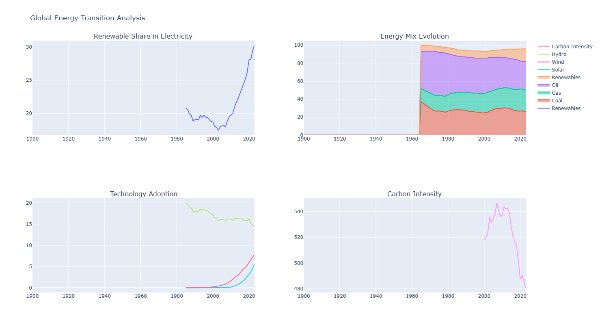
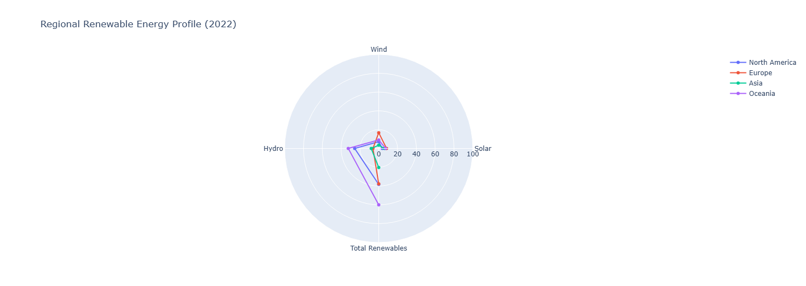
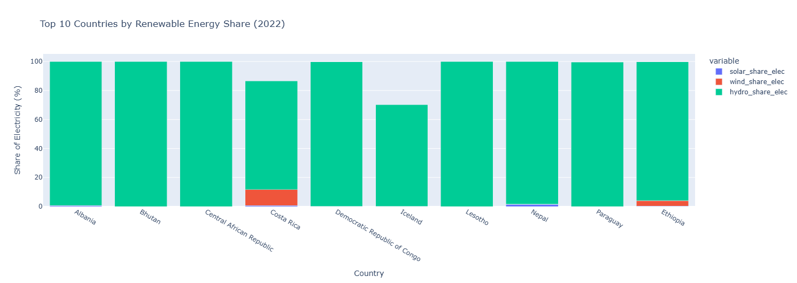

# Global Energy Transition Analysis

This repository contains a Python-based data visualization and analysis project that explores global energy transition trends using OWID Energy Data and World Energy Balances. It provides interactive visualizations using Plotly, Matplotlib, and Seaborn.

## Features

- Global Trends Analysis:
  - Tracks renewable energy growth, energy mix evolution, and carbon intensity.
- Regional Comparison:
  - Compares renewable energy adoption in different world regions.
- Top Countries Ranking:
  - Highlights countries with the highest renewable energy share.
- Key Metrics Display:
  - Summarizes essential global energy indicators.

## Folder Structure

```
energy-analysis
│── energy_analysis.py  # Main script for analysis and visualization
│── requirements.txt    # List of dependencies
│── README.md           # Project documentation
│── data                # Folder to store datasets
│    ├── owid-energy-data.csv
│    ├── WorldEnergyBalancesHighlights2024.xlsx
│── visualizations      # Folder for saved plots
│    ├── global_energy_transition_analysis.png
│    ├── regional_renewable_energy_profile_2022.png
│    ├── top_10_countries_by_renewable_energy_share_2022.png
```

## Installation and Setup

1. Clone the repository:
   ```bash
   git clone https://github.com/miraccozcan/energy-analysis.git
   cd energy-analysis
   ```

2. Install dependencies:
   ```bash
   pip install -r requirements.txt
   ```

3. Place the dataset files (`owid-energy-data.csv` and `WorldEnergyBalancesHighlights2024.xlsx`) in the `data` directory.

4. Run the analysis:
   ```bash
   python energy_analysis.py
   ```

## Visualizations

### Global Energy Transition Analysis


### Regional Renewable Energy Profile (2022)


### Top 10 Countries by Renewable Energy Share (2022)


## Dependencies

- `pandas` 
- `numpy` 
- `matplotlib` 
- `seaborn` 
- `plotly` 
- `openpyxl`
